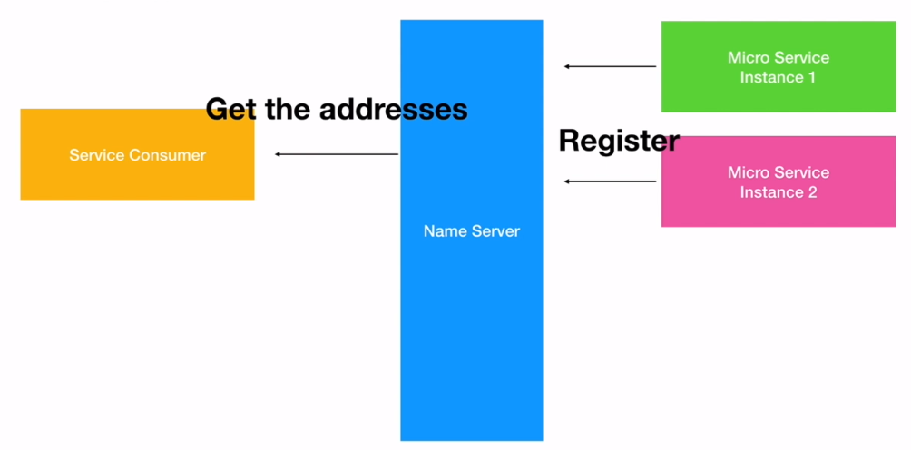
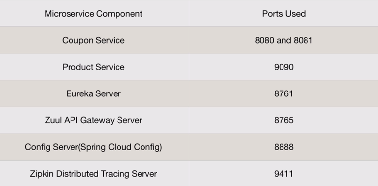

# Spring Microservices

## Different Frameworks & Components

#### Eureka (Naming Server)

Microservices register for names through Eureka, and service consumers will then communicate using the names.
Used for registration and discovery.

#### Feign Client
Used to create RESTful clients, instead of REST templates, can simply create interfaces and use GetMapping (declarative client management).

#### Ribbon (Client-side Load Balancing)
Distribute request across different instances of same microservices within the server.

#### Hystric (Fault Tolerance within Microservices)
When a microservices fails, should not throw exceptions - handle exceptions and should fall gracefully

#### Zuul Proxy
Used for service-side load balancing - main use is security for cross-cutting microservices.

#### Sleuth and Zipkin
Used for distributed tracing, Zipkin used for Dashboard UI.

## Why Spring Boot?
When implementing Microservices, a number of non-functional requirements will arise:
* **Service Registration & Discovery** - mechanism needed to reduce tight-coupling between microservices
* **Load Balancing** - load should be distributed amongst instances of microservices
* **Fault Tolerance** - should handle faults gracefully
* **Easy Integration** - communication is handled through RESTful client API
* **Cross Cutting Concerns** - shared concerns amongst all microservices - this includes Security,Authroisation, Authentication & Logging. Instead of implementing across all microservices, a centralised component should handle them.
* **Distributed Tracing** - should be able to trace what microservices a request goes through to diagnose which service has caused an error.

## Port Specification
The Coupon and Product Service are specific to our project. However, the rest are considered standard configurations for ports.

