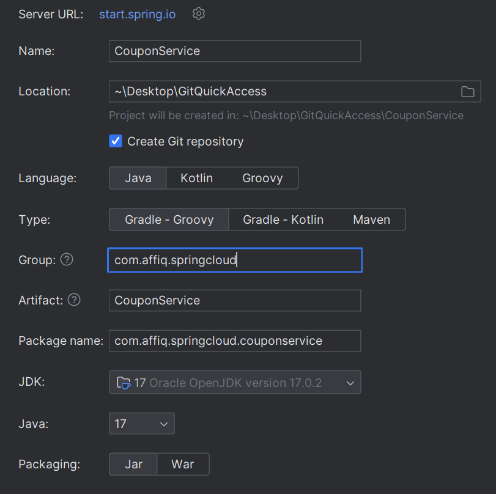
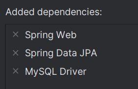
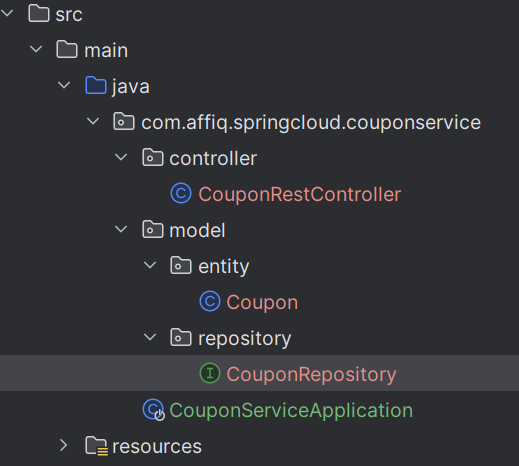
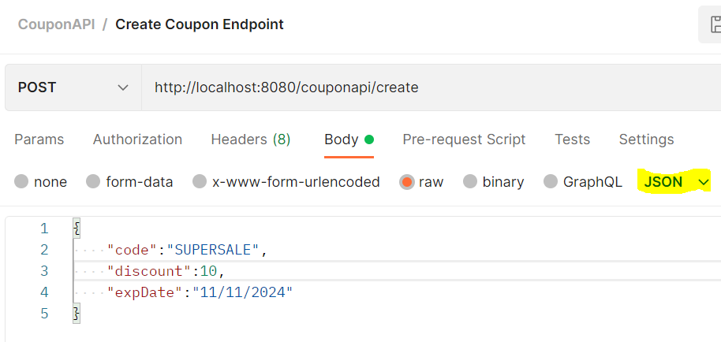
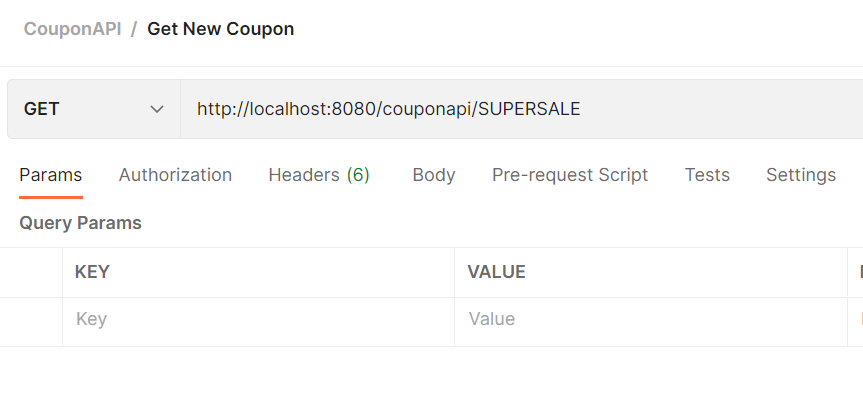
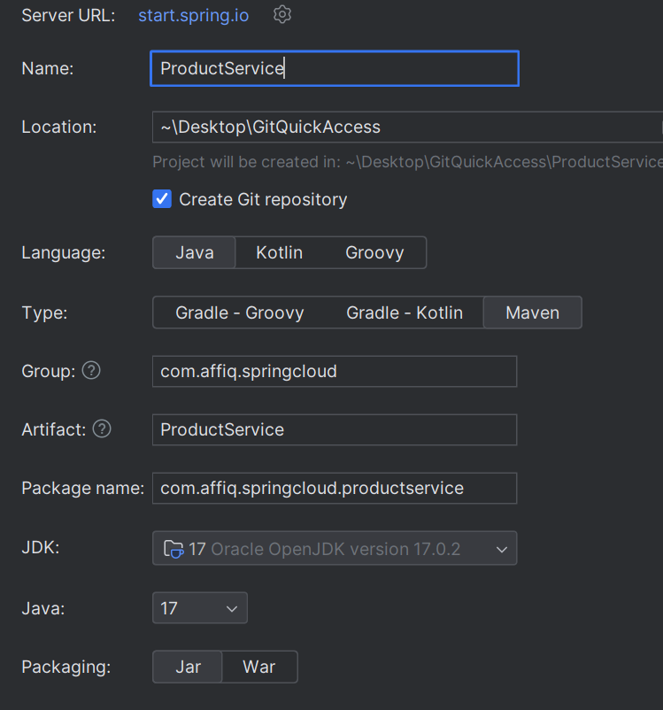
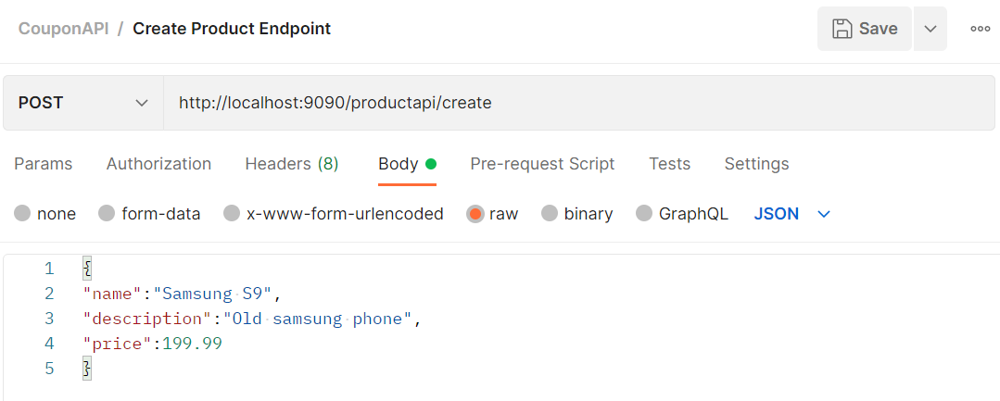

# Configure New Project
We will create a Coupon microservice and Product microservice for our project. 

We will need the following technologies for the project:
* **Java**
* **Spring Technology Suite** / **Spring Initialiser plugin**
* **MySQL + MySQL Workbench**
* **Postman**

## Setting Up our Database
To create our relevant database, we will first need to use MySQL workbench. Next we will need to define a new schema to use - in this instance, we will name it ```spring_cloud_ms_example``` and use the following script to generate our Coupon and Product table.

**SQL Query in workbench**
```
use spring_cloud_ms_example;

create table product(
id int AUTO_INCREMENT PRIMARY KEY,
name varchar(20),
description varchar(100),
price decimal(8,3) 
);

create table coupon(
id int AUTO_INCREMENT PRIMARY KEY,
code varchar(20),
discount decimal(8,3),
exp_date varchar(100) 
);

select * from product;

select * from coupon;
```

## Setting Up Coupon Microservice
We will then create a new project in Intellij with the following configurations (we should be using Maven instead of Gradle):



We will then need to search for and add the following dependencies:



### Creating Coupon Entity
We will now need to create a coupon entity under a model > entity package with the following code.

**Coupon.class**
```
@Entity
public class Coupon {
    @Id
    @GeneratedValue(strategy = GenerationType.IDENTITY)
    private Long id;
    private String code;
    private BigDecimal discount;
    private String expDate;

    public Long getId() {
        return id;
    }

    public void setId(Long id) {
        this.id = id;
    }

    public String getCode() {
        return code;
    }

    public void setCode(String code) {
        this.code = code;
    }

    public BigDecimal getDiscount() {
        return discount;
    }

    public void setDiscount(BigDecimal discount) {
        this.discount = discount;
    }

    public String getExpDate() {
        return expDate;
    }

    public void setExpDate(String expDate) {
        this.expDate = expDate;
    }
}
```

### Creating Coupon Repository
We will now need to create a coupon repository under a model > repository package with the following code. This can be done by going to the repository package, right clicking in project explorer, and clicking the option ```Spring Data JPA Repository``` and selecting ```Entity: Coupon``` to generate our code. Our code should look like:

**CouponRepository.class**
```
public interface CouponRepository extends JpaRepository<Coupon, Long> {
        Optional<Coupon> findByCode(String code);
}
```

### Creating Coupon Controller
We will now need to create a coupon repository under a controller package with the following code:

**CouponRestController.class**
```
@RestController
@RequestMapping("/couponapi")
public class CouponRestController {

    private CouponRepository couponRepo;

    @Autowired
    public CouponRestController(CouponRepository couponRepo) {
        this.couponRepo = couponRepo;
    }


    @PostMapping("/create")
    public Coupon createCoupon(@RequestBody Coupon coupon) {
        return couponRepo.save(coupon);
    }

    @GetMapping("/coupons/{code}")
    public Optional<Coupon> getCoupon(@PathVariable("code") String code) {
        return couponRepo.findByCode(code);
    }
}
```

Our final project structure should now look like:


### Configuring application.properties
We will now need to change application.properties located under the resources folder. Adjust name of table (spring_cloud_ms_example) and the mysql username and password accordingly.

**(Coupon) application.properties**
```
spring.datasource.url=jdbc:mysql://localhost:3306/spring_cloud_ms_example
spring.datasource.username=root
spring.datasource.password=password
```

### Testing using Postman
We will now test the Create Coupon API using Postman with the following configurations. (Ensure JSON is selected as Postman will deal with the ```content-type:application-json``` property)



If successful, the server should return the created coupon.

We will also test the Get Coupon API using postman with a simple endpoint.




Again, it should return the new coupon we have created within the database.


## Setting up Product Microservice
We will need to set up the product microservices with same Spring dependencies, as well as with the following configurations:



### Creating Product Entity

**Product.class**
```
@Entity
public class Product {
    @Id
    @GeneratedValue(strategy = GenerationType.IDENTITY)
    private long id;
    private String name;
    private String description;
    private BigDecimal price;

    public long getId() {
        return id;
    }

    public void setId(long id) {
        this.id = id;
    }

    public String getName() {
        return name;
    }

    public void setName(String name) {
        this.name = name;
    }

    public String getDescription() {
        return description;
    }

    public void setDescription(String description) {
        this.description = description;
    }

    public BigDecimal getPrice() {
        return price;
    }

    public void setPrice(BigDecimal price) {
        this.price = price;
    }
}

```

### Creating Product Repository
**ProductRepository**
```
public interface ProductRepository extends JpaRepository<Product, Long> {
}
```

### Creating Product Controller
```
@RestController
@RequestMapping("/productapi")
public class ProductController
{
    private ProductRepository productRepo;

    @Autowired
    public ProductController(ProductRepository productRepo) {
        this.productRepo = productRepo;
    }

    @PostMapping("/create")
    public Product createCoupon(@RequestBody Product product) {
        return productRepo.save(product);
    }
}
```

### Testing Product Controller



