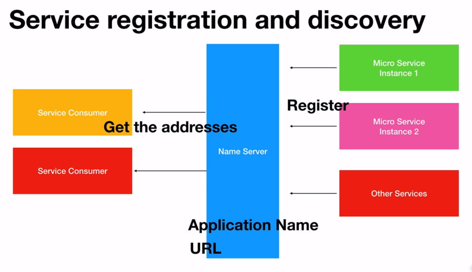
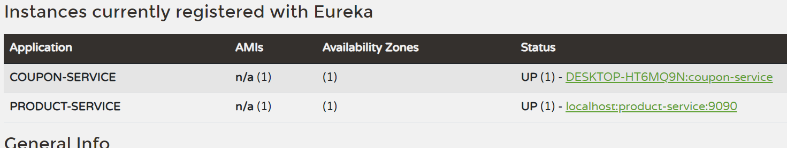

# Netflix Eureka

- [Netflix Eureka](#netflix-eureka)
  - [Theory](#theory)
  - [New Project](#new-project)
  - [Configuring Clients](#configuring-clients)
    - [Configuring pom.xml](#configuring-pomxml)
    - [Configuring application.properties](#configuring-applicationproperties)
  - [Testing our clients](#testing-our-clients)
  - [Sample Application pom.xml](#sample-application-pomxml)

## Theory



In applications where a microservice may be down or multiple instances of a microservices exist, consumers communicating with these microservices will be complex.

Hence, Netflix Eureka is used to decouple the microservices and consumers. It works by:
1) Microservices register to the Netflix Eureka server
2) Eureka then notes the application name along with a URL.
3) Consumers can then access these microservices through their URL.


## New Project
We will again create a new project/ spring application called EurekaServer. Go about the normal configurations, but add the Eureka Server and Spring Boot Web dependency only.

We will then add the ```@EnableEurekaServer``` annotation in our Spring Application such that:

**EurekaServerApplication.class**
```
@SpringBootApplication
@EnableEurekaServer
public class EurekaServerApplication {
    public static void main(String[] args) {
        SpringApplication.run(EurekaServerApplication.class, args);
    }
}
```

We will also change the application.properties file such that:

**(EurekaServer) application.properties**
```
server.port=8761
eureka.client.register-with-eureka=false
eureka.client.fetch-registry=false
```

## Configuring Clients
### Configuring pom.xml

**Potential Blocker:** Finding the right dependencies within your pom.xml to make the Eureka Client compatible with the Spring Cloud version. For convenience, the entire pom.xml will be provided at the end.

We will then need to modify our existing projects to be Eureka Clients. We will first need to add a specific cloud property - we will try and adopt the latest spring-cloud version.

```
<properties>
        <java.version>17</java.version>
        <spring-cloud.version>2023.0.0</spring-cloud.version>
</properties>
```

 the Eureka Client Maven dependency.
This can be done by going to the pom.xml file and doing ```Generate > Dependency > spring-cloud-starter-netflix-starter-eureka-client``` and selecting the dependency. Do not forget to reload Maven and ensure the selected version of the Eureka Client is compatible with Spring Cloud.

```
        <dependency>
            <groupId>org.springframework.cloud</groupId>
            <artifactId>spring-cloud-starter-netflix-eureka-client</artifactId>
            <version>4.1.0</version>
        </dependency>
```

We will then enable the Eureka client by adding the ``@EnableEurekaClients`` or ``@EnableDiscoveryClient`` to the main spring application. (below the ``@SpringApplication`` annotation)

```
@SpringBootApplication
@EnableEurekaClient
public class ProductServiceApplication {
    public static void main(String[] args) {
        SpringApplication.run(ProductServiceApplication.class, args);
    }
}
```

### Configuring application.properties
We will also need to hardcode the Eureka server URL into the clients' application.properties file. Our service application will also need a name to identify the microservice.

**(CouponService) application.properties**
```
...
spring.application.name=coupon-service
eureka.client.service-url.defaultZone=http://localhost:8761/eureka/
...
```

**NOTE:**
When using Spring Cloud 2023.X.X (Leyton) version, this does not require you to add the annotation - the framework will make the application a Eureka Client as long as the dependency is specified in the pom.xml!

## Testing our clients
To test our clients we will first need to:
1) Run the Eureka Server
2) Run the Coupon Service client
3) Run the Product Service client
4) Navigate to the Eureka Dashboard (http://localhost:8761)
5) Observe results (which should look as below)



## Sample Application pom.xml

```
    <properties>
        <java.version>17</java.version>
        <spring-cloud.version>2023.0.0</spring-cloud.version>
    </properties>

    <dependencies>
        <dependency>
            <groupId>org.springframework.cloud</groupId>
            <artifactId>spring-cloud-dependencies</artifactId>
            <version>${spring-cloud.version}</version>
            <type>pom</type>
            <scope>import</scope>
        </dependency>
        <dependency>
            <groupId>org.springframework.cloud</groupId>
            <artifactId>spring-cloud-starter-netflix-eureka-client</artifactId>
            <version>4.1.0</version>
        </dependency>
        <dependency>
            <groupId>org.springframework.boot</groupId>
            <artifactId>spring-boot-starter-data-jpa</artifactId>
        </dependency>
        <dependency>
            <groupId>org.springframework.boot</groupId>
            <artifactId>spring-boot-starter-web</artifactId>
        </dependency>
        <dependency>
            <groupId>com.mysql</groupId>
            <artifactId>mysql-connector-j</artifactId>
            <scope>runtime</scope>
        </dependency>
    </dependencies>

    <build>
        <plugins>
            <plugin>
                <groupId>org.springframework.boot</groupId>
                <artifactId>spring-boot-maven-plugin</artifactId>
            </plugin>
        </plugins>
    </build>
```