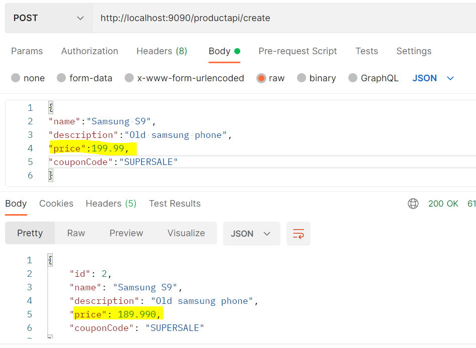

# Feign Clients

## Theory
We will now use FEIGN clients to communicate and create RESTful clients - as well as being easy to integrate into the Spring framework.

A Feign client is a component in the Spring Cloud ecosystem that simplifies the process of making HTTP requests to other microservices. It provides a higher-level abstraction over the usual HTTP client libraries by allowing you to define web service clients using a declarative and interface-based approach. Feign clients are particularly useful in a microservices architecture, where services need to communicate with each other over the network.

To implement a Feign client we will need to:
1) Go to Client and adding Feign dependency
2) Enable Feign client in client application
3) Create Feign client/interface in client application
4) Use the Feign client

## Adding Dependency
We will modify our Product Service to make a call to the Coupon Service.
We can simply copy our netflix eureka dependency and delete the netflix postfix to import:
```
 <dependency>
            <groupId>org.springframework.cloud</groupId>
            <artifactId>spring-cloud-starter-openfeign</artifactId>
        </dependency>
```

Alternatively, we can right click ```Generate... > Dependency > Manage Spring Initilaiser``` and add it through the UI.

## Enabling Feign Client
We will now navigate to the application level and add the ```@EnableFeignClients``` annotation.

## Creating a Client
We will now create a new package called restclient, as well as an interface under it called CouponClient. 

We will also copy the Coupon class from the previous project and add it under model, as our JSON response will be deserialised into a Coupon object. (remove all annotations and unnecessary imports).

Our feign client will function similar to a controller, where it would need a HTTP verb mapping, as well as any variable bindings. We will also need to specify the name of the service.

```
@FeignClient("COUPON-SERVICE")
public interface CouponClient {
    @GetMapping("couponapi/{code}")
    Coupon getCoupon(@PathVariable("code") String code);
}
```

## Using our Feign Client
We will need to make one more small modification to our product entity, and that is to add a Code variable/field. It will me annotated with ``@Transient`` to indicate that it does not need to be saved in the database, and will be used purely for business logic.

**Product.class**
```
@Transient
private String couponCode;
```

We can now modify our controller business logic to apply a discount to the product before saving. We will autowire the CouponClient in the product class before adding our business logic.

**Potential Blocker:** Your program may throw errors when attempting to autowire the CouponClient - ensure the ```@EnableFeignClients``` annotation is added to the main Spring application.

```
@RestController
@RequestMapping("/productapi")
public class ProductController
{
    private ProductRepository productRepo;
    private CouponClient couponClient;

    // Autowire CouponClient
    @Autowired
    public ProductController(CouponClient couponClient, ProductRepository productRepo) {
        this.couponClient = couponClient;
        this.productRepo = productRepo;
    }

    @PostMapping("/create")
    public Product createCoupon(@RequestBody Product product) {
        Coupon coupon = couponClient.getCoupon(product.getCouponCode());
        // Subtract value - can change to multiplier value
        product.setPrice(product.getPrice().subtract(coupon.getDiscount()));
        return productRepo.save(product);
    }
}
```

## Testing our Microservices
We will now go to Postman and create a new version of our Create product request, while adding the new CouponCode value in. We should observe from the response that the discount is then applied to our product.

