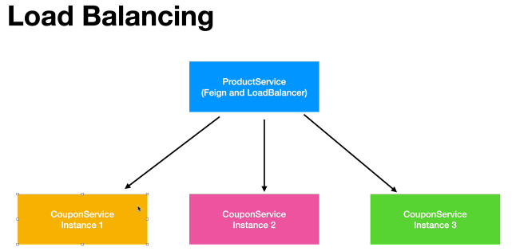
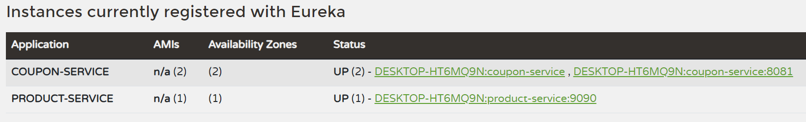

# Load Balancing

## Theory



As number of requests increases, we will need multiple instances of a microservices to meet the demand. The load balancer is responsible for distributing the requests to appropriate instances to prevent overloading. To load balance, you simply have to add a load-balancing dependency to the appropriate microservice project. The feign client will automatically work with the load balancer.

## Adding Dependency
We can do the same technique and edit the raw pom.xml file, copying the spring-cloud-starter-netflix... dependency and replacing it with ```loadbalancer```. Alternatively we can add it through Spring Initializr method as stated before.

# Running Multiple instances
We will first make a small modification in the Coupon application, inside the CouponController, getCoupon should display "Server 1". We can then run this Spring application.

**Potential Blocker:** You may have to go to ``Run > Edit Configurations > Modiy > Allow Multiple Instances``.

We will then change the application.properties to use a different port, changing the printing function before finally running the application.

Once we use Postman to create new products, you should find the requests get distributed between each application as they will print on different consoles.


