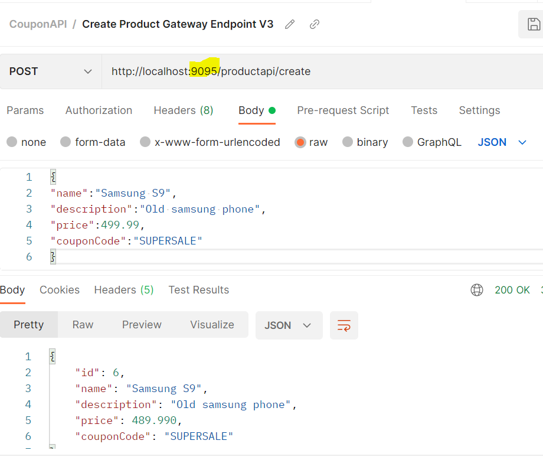
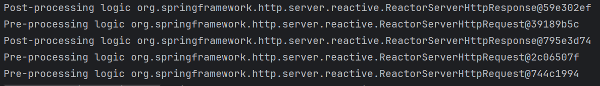

We will often run into a number of non-functional requirements, called cross-cutting concerns as they are common across all microservices, such as:
* **Security** - Authentication, Authorisation, Encryption, Decryption
* **Tracing** - how traffic/processes go through each service
* **Service Aggregation** - when multiple services are called
* **Rate Limiting** - control cloud resources usage

These can be addressed using the Spring API Gateway component.
All client requests will then be redirected to the API Gateway.

Routing configuration can be done via application.properties or Java based approach.

We will need to:
1) First create a new API Gateway Project
2) Enable the application as a Eureka Client
3) Import starter-gateway dependency
4) We will then need to configure the routes.
5) (Optional) Rework any feign clients to communicate with gateway

## Configuring Routes
We will need to configure our microservice to run on a different port, as well as specify the routes.

* The ID is a unique way of identifying our microservice.
* The URI specifies how the gateway should then communicate with the microservice - the lb prefix is used to reference the load balancer
* The predicate decides which paths it is able to communicate with, these should ideally match the controllers in the application. This allows you to 'filter' which controllers are accessible by the gateway.

**application.properties**
```
spring.application.name=gateway-service
eureka.client.service-url.defaultZone=http://localhost:8761/eureka/
server.port=9095

spring.cloud.gateway.routes[0].id=couponModule
spring.cloud.gateway.routes[0].uri=lb://COUPON-SERVICE
spring.cloud.gateway.routes[0].predicates[0]=Path=/couponapi/**

spring.cloud.gateway.routes[1].id=productModule
spring.cloud.gateway.routes[1].uri=lb://PRODUCT-SERVICE
spring.cloud.gateway.routes[1].predicates[0]=Path=/productapi/**
```


## Rework Feign Clients
In our current project, our Product Microservice currently communicates with the Coupon Microservice directly. Here, we will adjust it so that it communicates with the gateway instead.

## Testing
We will first need to run the Eureka Server, followed by the microservices, and then the API gateway. We will then need to communicate the same way with the Product Postman test, except we will communicate with the API gateway on port 9095 instead.



## Filters
Filters allow pre-processing logic before requests are sent to microservices - this addresses the cross-cutting concerns mentioned earlier. We can also perform post-processing logic, as well as conditional routes and exception handling routes.

To create a filter, we will need to:
1) Implement an interface
2) Override the methods
3) Register the filter

Filters make use of the Mono, Exchange and Filter classes. Typically, Filters are made under a new package called Filters.

We can either implement Filter or GlobalFilter if we want it to apply to all routes.

**Potential Blocker:** Spring Initalizr may implement the wrong dependency needed - simply delete the mvc postfix on the dependency.

**MyFilter.class**
```
@Component
public class MyFilter implements GlobalFilter {

    @Override
    public Mono<Void> filter(ServerWebExchange exchange, GatewayFilterChain chain) {
        System.out.println("Pre-processing logic "+exchange.getRequest());
        return chain.filter(exchange).then(Mono.fromRunnable(() ->
                System.out.println("Post-processing logic "+exchange.getResponse()))
        );
    }
```

Once we have reran our Gateway project, we can then observe the logic within the console.

