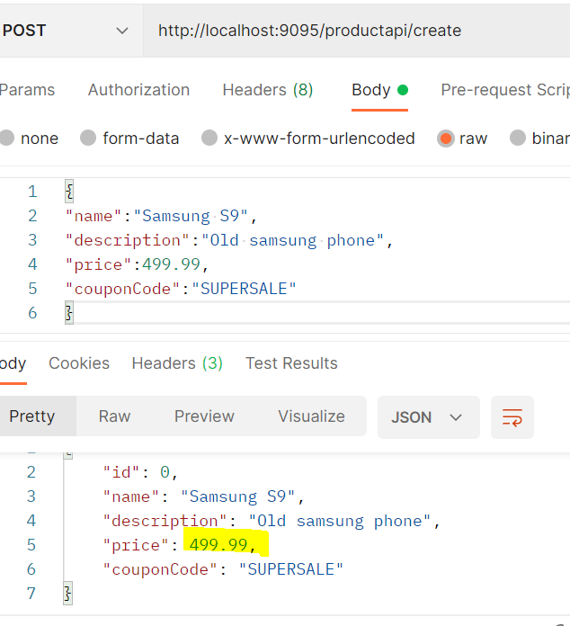

# Resilience4j

This will be used to ensure a level of fault tolerance across all our microservices. We will first need to import two dependencies in all our projects using fault tolerance - Spring Actuator and Resilience4j for Spring.

```
   <dependency>
            <groupId>org.springframework.boot</groupId>
            <artifactId>spring-boot-starter-actuator</artifactId>
    </dependency>
    <dependency>
            <groupId>io.github.resilience4j</groupId>
            <artifactId>resilience4j-spring-boot2</artifactId>
            <version>2.1.0</version>
    </dependency>
```

We then specify a class with annotations, give it a unique name and specify its configuration in the application.properties. We can also specify fall-back methods.

We will use the ```@Retry``` annotation to determine the number of times a method should be tried if unsuccessful. Here we will create an annotation for our create product endpoint.

**ProductController.class**
```
    @PostMapping("/create")
    @Retry(name="product-api-create")
    public Product createCoupon(@RequestBody Product product) {
        Coupon coupon = couponClient.getCoupon(product.getCouponCode());
        // Subtract value - can change to multiplier value
        product.setPrice(product.getPrice().subtract(coupon.getDiscount()));
        return productRepo.save(product);
    }
```

We can then specify the configuration within the application.properties file, where the name of the retry should match the configuration

**application.properties**
```
resilience4j.retry.instances.product-api-create.max-attempts=3
resilience4j.retry.instances.product-api-create.wait-duration=3s
```

We can then test this by purposely introducing an error into our application by heading to the Feign client in our Product microservice and editing the called URL. When testing the port 9095 endpoint, you should notice it will take ~6 seconds to process the update due to our new fault tolerance configuration.

**CouponClient.class**
```
    @GetMapping("couponap/{code}")
    Coupon getCoupon(@PathVariable("code") String code);
```

## Fallback Methods
The retry of course will still send an exception back to the client. We can provide an implementation in the case of failed retries labelled as a 'fallback' method or 'gracefully failing'. Within the ```@Retry``` annotation, we add a ```fallbackMethod``` value.

**ProductController.class**
```
 @PostMapping("/create")
    @Retry(name="product-api-create", fallbackMethod = "createFallback")
    public Product createCoupon(@RequestBody Product product) {
     ...
    }

    public Product createFallback(Product product, Exception exception) {
        System.out.println("Retries failed - falling back");
        return product;
    }
```

Now once we test it again, it will take roughly the same time - however an exception will not be thrown and instead the original product without a discount applied will be shown. However, the product is not saved (as specified in our original implementation) as an exception stops it from reaching to the save feature - hence the Id returned is 0.



Likewise if we observe the console for our Product Service we will see the appropriate printing.


