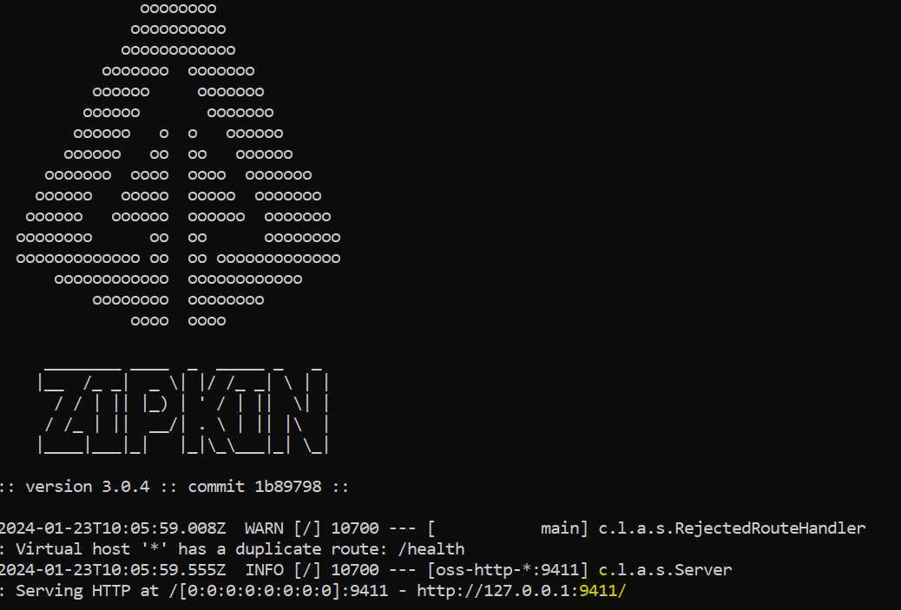
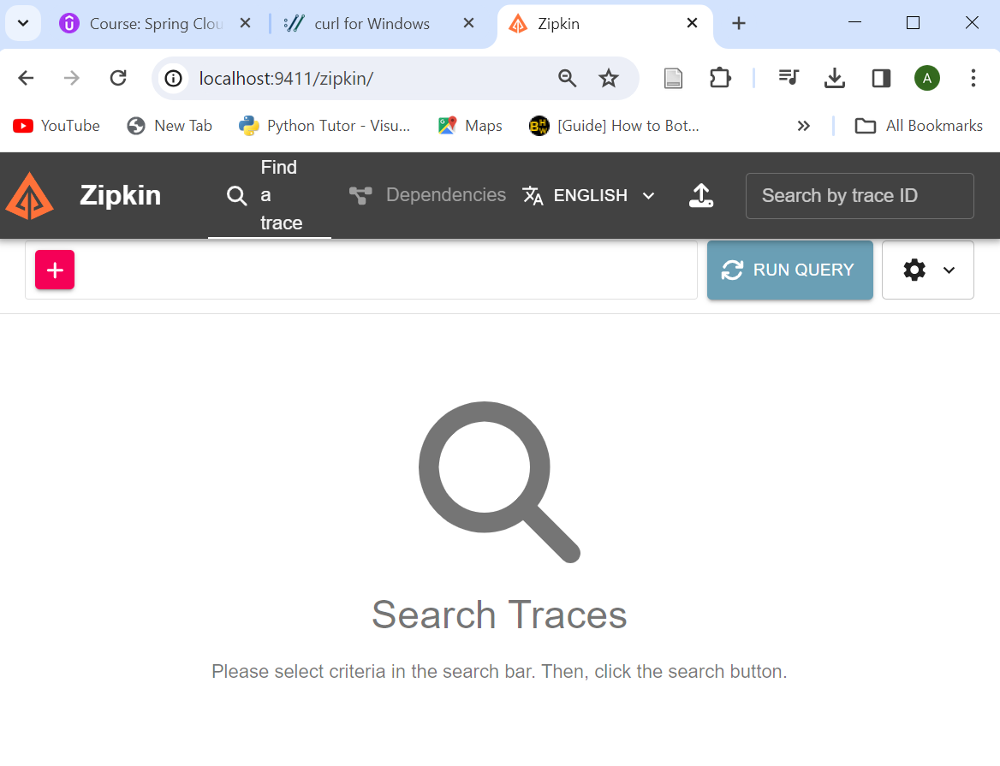

# Sleuth & Zipkin

Given many microservices and potential loads going through a convoluted route, it is important to have a distributed tracing mechanism - so when a request fails, we will need to know where it has failed.

We will need to add these dependencies to the core services (Product Coupon and the API gateway).

As our requests travel through microservices, Sleuth is responsible for adding traceIds to the headers.

Zipkin is responsible for exporting and dashboarding all these traced requests.

Our product microservices have some level of complexity, as a request could potentially travel through 
```apigateway > product > apigateway > coupon > apigateway```

## Setting up Zipkin Server
We will need to install and run the Zipkin server locally. 

```
curl -sSL https://zipkin.io/quickstart.sh | bash -s

java -jar zipkin.jar
```

By default, Zipkin should run on port 9411 and can be accessed through the web browser through ```http://localhost:9411```.




## Adding Dependencies
We will need to add the following dependencies to the pom.xml for every service.

**Potential Blocker:** Be careful when using Sleuth 3.1+ as the package is outdated and suggests using a different package altogether. In some cases, an added configuration in application.properties can solve this ```spring.cloud.compatibility-verifier.enabled=false```

**pom.xml**
```
        <dependency>
            <groupId>org.springframework.cloud</groupId>
            <artifactId>spring-cloud-starter-sleuth</artifactId>
            <version>3.0.6</version>
        </dependency>

        <dependency>
            <groupId>org.springframework.cloud</groupId>
            <artifactId>spring-cloud-sleuth-zipkin</artifactId>
            <version>3.1.9</version>
        </dependency>
```

COULD NOT TEST DUE TO INCOMPATIBLE VERSIONS