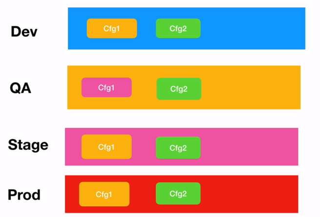

# Central Configuration

Every microservice has a configuration involved. This involves:
* Database Configurations
* Message Brokers
* Application Configuration

The configuration may also be appropriate for local environments, which may differ from developers, testing, staging and production environments.



Spring solves this problem with the use of Configuration Servers - configurations are pushed to Git repository.

## Creating the Config Server
We will need to import the Spring Config Server dependency.

**pom.xml**
```
        <dependency>
            <groupId>org.springframework.cloud</groupId>
            <artifactId>spring-cloud-config-server</artifactId>
        </dependency>
```

We will then need to specify the application name and port.

**application.properties**
```
spring.application.name=config-server
server.port=8888
```

## Creating Repository
We will then need to create a Git repository. For simplicity, we will create a local repository.

We will then create a txt file that should match the name of the microservice ending with .properties (in this case product-service) and specify the following configurations:

**product-service.properties**
```
management.security.enabled=false
application.url=http://local
```
[need content about properties]

We will then need to commit and add this file.

## Connecting the Config Server to Repo

We will then need to go to our config server and connect to our repository. If it is remote, we can simply use the URL, but if it is local, we can use ```file:///```. We can also use env variables provided by Spring Cloud.

**application.properties**
```
spring.cloud.config.server.git.uri=file:///${user.home}/relativepathtofile
```

We can then run our application and test our default configuration using the following url.
```http://localhost:8888/product-service/default```

## Environment Specific Configuration
We can create environment specific configurations by adding a postfix to another properties file within the git repo. For example ```product-service.properties -> product-service-dev.properties```.

**product-service-dev.properties**
```
management.security.enabled=false
application.url=http://dev
```

We can now access the dev properties configuration through the url. ```http://localhost:8888/product-service/dev```. It is also worth noting that the default configuration is also visible on this endpoint.


## Creating a Config Client
We will now need to go to our product client and add the Config Client dependency through Spring Initializr. We will then transfer the application.properties for the Product Service to the application.properties in our Git Repository (and removing the URL and applicatio name property).

**product-service.properties**
```
management.security.enabled=false

spring.datasource.url=jdbc:mysql://localhost:3306/spring_cloud_ms_example
spring.datasource.username=root
spring.datasource.password=password

server.port=9090

eureka.client.service-url.defaultZone=http://localhost:8761/eureka/

resilience4j.retry.instances.product-api-create.max-attempts=3
resilience4j.retry.instances.product-api-create.wait-duration=3s
```

while in our original Product Service application.properties file, we specify the application name and the config server URL...

**application.properties**
```
spring.application.name=product-service
spring.config.import=optional:configserver:
```

We will then need a new file called ```bootstrap.properties```.

**bootstrap.properties**
```
spring.cloud.config.uri=http://localhost:8888
```

We can then run the application and observe that it will use the configuration from the server by observing the port number that it opens at.

We will also edit the product-service-dev.properties file with the same configurations except that it runs on port 9093. We will then need to add a configuration to application.properties

**application.properties**
```
spring.profiles.active=dev
```